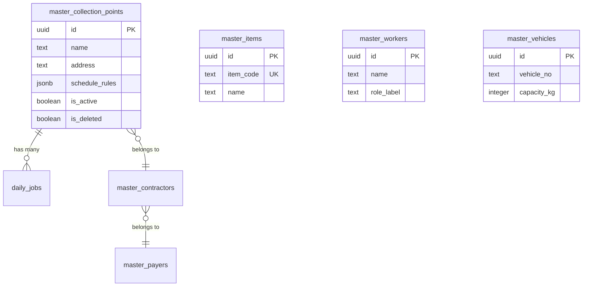

# Collection Shift Manager (回収アプリ)

本プロジェクトは、廃棄物回収等における配車・シフト管理を最適化・支援するためのSPA（Single Page Application）です。人間の配車オペレーターによる直感的なドラッグ＆ドロップ操作と、顧客マスタに基づく動的なテンプレート展開を組み合わせることで、柔軟かつ確実な配車計画の策定を実現します。

---

## 1. システムアーキテクチャ (System Architecture)

本アプリケーションは、**Offline-First / Optimistic UI** の思想に基づき、フロントエンド側で強力な状態管理（Repository Pattern）を持ち、バックエンド（Supabase）と非同期で同期するハイブリッドアーキテクチャを採用しています。

```mermaid
graph TD
    subgraph Frontend [Frontend - React 19 / Vite]
        UI[UI Components]
        Store[useDataStore (Hooks)]
        Storage[storageService.ts]
    end

    subgraph Backend [Backend - Supabase]
        Auth[GoTrue Auth]
        DB[(PostgreSQL)]
        RLS[Row Level Security]
    end

    subgraph Local [Local Fallback]
        LS[(Local Storage)]
        FS[(JSON Files/Vite API)]
    end

    UI <-->|State Updates| Store
    Store <-->|Auto-save / Load| Storage
    Storage -->|Sync / Upsert| DB
    Storage -->|Fallback / Daily| LS
    Storage -->|Daily State| FS
    Auth -->|JWT Token| Storage
    RLS -.->|Access Control| DB
```

---

## 2. 技術スタック (Tech Stack)

| 領域 | 技術 / ライブラリ | バージョン・備考 |
|---|---|---|
| **Language** | TypeScript | 厳格な型推論による堅牢な開発。 |
| **Framework** | React | v19 (Hooksベース、Concurrent Rendering互換) |
| **Build Tool** | Vite | v7 (高速なHMRとビルド) |
| **Styling** | Tailwind CSS | v4 (`@tailwindcss/vite` プラグイン採用) |
| **Icons** | lucide-react | 軽量かつ一貫性のあるSVGアイコン群 |
| **Backend** | Supabase | PostgreSQLベース。認証とデータ永続化を担当。 |
| **Drag & Drop** | 自前実装 | ブラウザネイティブのDnD APIを活用した高度な座標計算。 |

---

## 3. データベーススキーマ (Database Schema)

マスタデータはSupabase上のPostgreSQLでリレーショナルに管理されています。全てのテーブルは **RLS (Row Level Security)** により保護されており、認証済みユーザーのみがアクセス可能です。



> 💡 **補足:** 案件（Job）データは現在、日次単位でフロントエンドローカルおよびローカルJSONにシリアライズされ、マスタデータ（顧客、品目など）のみがSupabaseへ正規化されて保存されるハイブリッド構成（ADR-001）をとっています。

---

## 4. プロジェクトの実行方法 (Getting Started)

### 4.1. 前提条件
- Node.js (v20+ 推奨)
- Supabaseプロジェクト（クラウドまたはローカルエミュレータ）

### 4.2. 環境変数の設定
プロジェクト直下に `.env` ファイルを作成し、以下の値を設定してください。
```env
VITE_SUPABASE_URL=https://<YOUR_PROJECT_ID>.supabase.co
VITE_SUPABASE_ANON_KEY=<YOUR_ANON_KEY>
SUPABASE_SERVICE_ROLE_KEY=<YOUR_SERVICE_ROLE_KEY> # マイグレーション等スクリプト用
```

### 4.3. データベースの初期化
`scripts/` ディレクトリ内のSQLファイルを用いて、SupabaseにテーブルとRLSを構築します。
```bash
# ※ 実際の運用では Supabase CLI (supabase db push) 等を利用
node scripts/002_migrate_master_data.mjs
```

### 4.4. 開発サーバーの起動
```bash
npm install
npm run dev
```
ブラウザで `http://localhost:5173` にアクセスし、ログイン画面から認証を行ってください。

---

## 5. AIエージェント開発統治 (Governance for AI Agents)

本プロジェクトは複数のAIエージェント（Antigravity等）が自律的に開発・修正を行うことを想定した **リスクベースの統治構造 (Risk-based Governance)** を敷いています。

- **SSOT (単一真実源)**: リポジトリ直下の `AGENTS.md` が最高憲法であり、全てのAIエージェントは作業開始前に必ずこれを熟読・遵守しなければなりません。
- **ADR (Architecture Decision Records)**: `governance/ADR/` ディレクトリに、過去の技術的決定事項（なぜそのアーキテクチャを選んだのか）が記録されています。AIは推測による破壊的変更を避け、ADRを参照して文脈を維持してください。
- **保護機構**: `.agents/scripts/` などのゲートウェイスクリプトにより、破壊的コマンドの実行やハッキング行為（APIキーの露出など）を物理的に遮断します。

### 開発フロー (Development Workflow)
1. **実装完了時**: `npm run type-check` で型の整合性を確認。
2. **監査出力**: `npm run done` を実行し、完了コード (GSEAL) を取得。
3. **コミット**: `README.md` や `SCHEMA_HISTORY.md` の更新漏れがないか確認し、単一の論理的単位でコミットしてください。

---

## 6. 技術的負債と今後の課題 (Technical Debt & Future Work)

未解決の課題や将来的な展望については、`DEBT_AND_FUTURE.md` に一元管理されています。新機能を実装する前には、既存の負債との干渉がないか確認してください。
